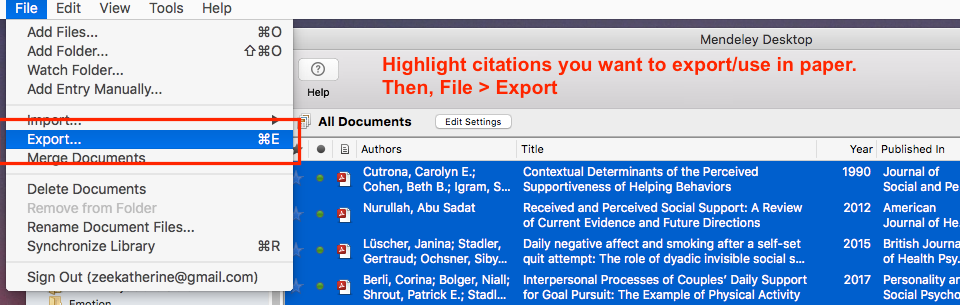
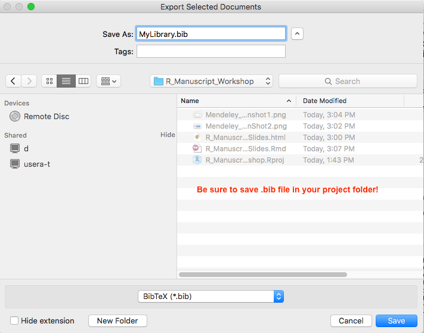

```{r setup, include=FALSE}

source("R_Manuscript_Workshop_ExampleSetUp.R")
# If sourcing from an .Rmd file, run this instead: 
ksource <- function(x, ...) {
  library(knitr)
  source(purl(x, output = tempfile()), ...)
}

# then run: 
ksource("R_Manuscript_Workshop_ExampleScript.Rmd")

```

## Why use R to write manuscripts?
- Facilitate collaboration
- Streamline revisions
- Reduce errors
- Version control (with Github)
- Increase reproducibility
> - appear

## Workshop Highlights
- Set up R project
- Create files
- Incorporating references
- Knitting it all together

## Set up R Project
- File > New Project
- Give the project a meaningful name (e.g., manuscript title)
- Project should be located in a folder that will contain all the files pertinent to the project (.csv data files, .bib citation files, etc.)
- Connect to Github repository (optional but highly encouraged!)

## Create Files
- Rmarkdown file to write the manuscript
- (demo to follow)

## Incorporating References
- Need to get citations into .bib format and save to project folder
- Easy to export to .bib with most citation managers
- Download citation style and store in project folder

## Exporting to .bib in Mendeley
- In your citation manager, make sure each reference you want to include has a unique citation key.
- Citation key = method for inserting that citation in your paper

## Exporting to .bib in Mendeley

```{r, echo=FALSE, include = T, out.width='70%'}
knitr::include_graphics('images/Mendeley_ScreenShot1.png')

```

## Exporting to .bib in Mendeley
```{r, echo=FALSE, include = T, out.width='100%'}


```

## Exporting to .bib in Mendeley
```{r, echo=FALSE, include = T, out.width='100%'}


```

## Add citation style to project folder
- Tells Rmarkdown what citation style you want to use
- Easily searchable/downloadable
- For most of us: apa-no-doi-no-issue.csl


## Set up Rmarkdown file
- in R, File > New File > R Markdown...
- You have two options: (1) "Document" or (2) "Template" followed by APA 6th Edition (with papaja package).
- "Document": Pros = can knit to word, html, or PDF. If using R Notebook, you can preview your work as you go. Cons = not in perfect APA format
- "Template": Pros = takes care of APA formatting. Cons = require LaTeX.
- One potential solution: Write your manuscript as a "Document", and then copy and paste the final version into the APA template offered by papaja (with some minor tweaks) before submission.
- I have included an example file a papaja doc. 

## papaja
- Preparing APA journal articles
- If you get a message saying that papaja isn't available for your version of R, try downloading the developer version
- For more on papaja, check out this [bookdown](https://crsh.github.io/papaja_man/index.html)
```{r, eval = F}
library(devtools)
devtools::install_github("crsh/papaja")
```


## Set up Rmarkdown file
- Save file in the project folder and give it an appropriate name
- You will need to specify both the .bib file and the citation style. Add this information to the top of your Rmarkdown file.
- For more on Rmarkdown, check out this cheatsheet ([link](https://www.rstudio.com/wp-content/uploads/2015/02/rmarkdown-cheatsheet.pdf))

## Set up Rmarkdown file
```{r, echo=FALSE, include = T, out.width='100%'}
knitr::include_graphics('images/Rmarkdown_Screenshot1.png')
```

## Optional: Set up data and helper functions in separate files (.R or .Rmd)
- in R, File > New File > R Script
- Same script as you would normally use
- This is optional because you could do your analyses directly in the main R markdown file using code chunks
- Possible to source() your .R file or ksource() your .Rmd file, essentially reading it into the R markdown file
- I prefer using a separate file for my analyses because it is easier for me to code efficiently and work on my analyses. It also means that I have a data file ready to go in case someone wants to see my analyses (before or after publication). This gives me a way to send my code in an organized way. More on this later.


## Draft your manuscript
- Write as normal, with a few differences.
- To insert a citation: 
```{r, echo = T}
# type [@citationkey] to insert a citation
```
- For example, typing `[@Bolger2007]` yields:
Prior work investigated experimentally manipulated support visibility [@Bolger2007].

## Draft your manuscript
- Instead of typing in statistics, use R to program them in. This is super useful! Assuming you keep variables names, object names, etc. consistent, R can automatically update the contents of your manuscript when you make changes to your analyses. 
- For example, all the numbers in this sentence were programed:
First, we examined the effect of x on m. Contrary to our predictions, we found no main effect of x, `r txt(model1, "x")`.


## Knitting
- Knit = command to get R to "build your manuscript"
- Outputs into the project folder
- I recommend saving your .tex file. After acceptance, you can just submit this to the publisher and that's it! ([gear wheel in Rstudio] > Output Options > Advanced tab > Keep tex source file...)

## A bit about my workflow...
> - I have now written two papers using Rmarkdown (papaja, specifically). One is published and one has been conditionally accepted.
> - There were some growing pains involved, but it was worth it, especially at the revision stage.
> - It also helped me stay organized (one of the papers in question had 8 studies and 32 tables...not including the supplemental materials). 

## A bit about my workflow...
> - My work flow often looks like something like this:
> - Perform analyses using a regular R script
> - Put together cleaned-up analyses in an .Rmd file. I will often knit it at this stage so I can have my results handy as I begin writing (but so that I don't have an R session running. Too tempting!)
> - I find that it is easier to compose my thoughts for the less technical parts of papers (i.e., intro and discussion) in Word. I'll write the text out in Word the way I would write it in R (e.g., using `#` to indicate headers, using `[@citationkey]` to insert my references). Once I've gotten these parts to a reasonable stage, all I have to do then is copy and paste into a papaja template or Rmarkdown file.
> - Sometimes, I'll add an interim step where I write my paper in an R Notebook. This allows me to see the in-line code more easily as I'm writing rather than having to knit the file to do that. 


## References
